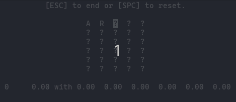

<p align="center"></p>
<h1 align="center">Wordle</h1>

# Introduction

> _Wordle_ is a web-based word game created and developed by Welsh
> software engineer Josh Wardle, and owned and published by The New
> York Times Company since 2022. Players have six attempts to guess a
> five-letter word, with feedback given for each guess in the form of
> colored tiles indicating when letters match or occupy the correct
> position. --[Wikipedia][INT]

You can play the official Wordle each day at https://www.nytimes.com/games/wordle.

## Official Rules

> Each guess must be a valid five-letter word. Hit the enter button to
> submit. After each guess, the color of the tiles will change to show
> how close your guess was to the word.
>
> - Green means the letter is in the word and in the correct spot.
> - Yellow means the letter is in the word but in the wrong spot.
> - Grey means the letter is not in the word in any spot.
> 
> --New York Times (24 May 2022)

## Terminal

This repository contains a minimal text-based version of Wordle that can be played in the terminal. It is stateless, i. e., does not remember any statistics once the program exits. It does not pick the same unique word everyday as the official New York Times web-app. It is a bare-implementation that picks a random word (albeit from the same list) at each start for the player to guess.

# Installation

The terminal app is built in Python 3. Hence to install it on your system, you'll need to install Python 3 (the interpreter), Pip (Python package manager) and Wheel (Python packaging standard).

## Python Setup

This is different for every operating system but it is likely that Python 3 is already installed. Note that I don't mean Python 2. You can check by running `python3 --version` or `python --version` if something like `Python 3.10.4` is printed--you're good. Otherwise you'll need to install Python 3 on your computer. For Debian based operating systems (Ubuntu and party),

Before you try installing anything, you can check what's already there by,

~~~
apt list python3 python3-pip python3-wheel
~~~

To install,

~~~
sudo apt install python3 python3-pip python3-wheel
~~~

Now if you wish to try out the terminal Wordle in a virtual Python environment,

~~~
cd path/to/wordle
python3 -m venv .venv
source .venv/bin/activate
which pip3
~~~

Above will create a virtual environment directory in `path/to/wordle` and activate it for only that terminal instance. `deactivate` will deactivate it once you are done.

## Installing & Uninstalling

If you have Python 3 and Pip set-up correctly. Navigate to the `path/to/wordle` and

~~~
pip3 install .
pip3 show wordle
~~~

To uninstall,

~~~
pip3 uninstall wordle
~~~

# Game-play

`wordle` command should launch the game and you can play it. Here are some controls.

- <kbd>x</kbd> -- any lower-case letter in the standard 26 letter English alphabet. Turn off the CapsLock.
- <kbd>BACKSPACE</kbd> -- reset the last letter input and move the cursor back.
- <kbd>RET</kbd> -- check your guess by pressing enter/return.
- <kbd>ESC</kbd> -- end the game.
- <kbd>SPC</kbd> -- start a new game.
- <kbd>TAB</kbd> -- toggle a list of sieved words. This list is initially truncated and sorted per to the word's usage in English.
- <kbd>CTRL</kbd>+<kbd>c</kbd> -- If you know, you know.

## Dolittle & Scribe

These are two AI players. [Dolittle][DTL] plays like a human. You can watch her play in the gif atop. The statistics bellow the board are (from left to right),

```
[Index]
[ of  ]   [total]         [    1    ] [    2    ] [    3    ] [    4    ] [    5    ] [    6    ]
[game ]   [ win ]   with  [ attempt ] [ attempt ] [ attempt ] [ attempt ] [ attempt ] [ attempt ]
[ in  ]   [rate ]         [wins rate] [wins rate] [wins rate] [wins rate] [wins rate] [wins rate]
[play ]
```

`wordle -d` or `wordle --dolittle` kicks off Dolittle and she plays 100 game. Her favourite opener is "artsy" `;-)`.

Scribe can be run with `wordle -s <opener> <n>` or `wordle --scribe <opener> <n>`. Scribe plays _n_ games each with _opener_ without any TUI (terminal user interface).  At each game, the win-rate distribution (as explained above for Dolittle) is printed. Since scribe is running headless, it finishes a lot quicker and you can see the final results in seconds. This can help you empirically evaluate an opener.

Both of these players play like a human (on an algorithmic level). They maintain a list of words, i. e., their vocabulary and sieve it using the information revealed by the colour-coded tiles at each guess. Then they pick their next best guess from the sieved list and so forth. I am calling this "AI" because, well, there are probabilities and data involved (heh ok sorry...).

Lastly, `wordle --help` or `wordle -h` will print out help.

# Development

Feel free to clone the repository and poke around. The project has only one dependency outside of standard Python packages: _Blessed_. I used it to rendezvous the colours and other TUI elements cross-platform. Read their documentation at https://blessed.readthedocs.io. You can install it with Pip,

Note that you may want to create a virtual environment as talked about in the **Python Setup** section above.

~~~
pip3 install blessed
~~~

Now navigate to the project root and,

~~~
python3 -m wordle
~~~

All the options described above will work here as well, e. g.,

~~~
python3 -m wordle --dolittle
~~~

I found the [setuptools documentation][STP] and this article [A Practical Guide to Using Setup.py][ART] helpful as well.

## Data

I downloaded the data from the good people at [Wolfram][WLF]. It included the common five letter words and their usage-frequency _0 < p < 1_ in the English Language. Since I used the free-tier account, I was not able to run the bellow command in one shot. But--you seem to be able to ask for the data in computationally feasible slices and save them in files. I later concatenated the files on my own machine. Unfortunately, I only made a note of the general command and not the version that asks for the slices. Although, IIRC, it only differs from the given one by the addition of some 5 characters.

~~~
CloudExport[Dataset[WordFrequencyData[Select[WordList[], (StringLength[#] == 5) &]]], "csv", "wordslist"]
~~~

I correlated the data from Wolfram with the list that is (or at least used to be) sent with the Wordle web-app's source code. I was only missing a few words. I then went back and downloaded the frequencies of the missing words and added them manually to the final word-list.

All of these files are present in the data directory.

# Commentary

Josh Wardle wrote _Wordle_ during the COVID-19 pandemic. It was his _quarantine project_ so to speak. His girlfriend sifted out the less-common words in order to make the game accessible to more people. Wardle would go on to sell the game to _The New York Times_ for a seven-figure price tag.

I got interested in the game after watching [Grant Sanderson's video][3BB] relating it to information theory. I wanted some sort of a way to run my own trials and hence this project was born.

# The MIT License (MIT)

[Copyright © 2022 Ahmad Tashfeen][MIT]

[INT]: https://en.wikipedia.org/wiki/Wordle
[DTL]: https://en.wikipedia.org/wiki/Eliza_Doolittle
[WLF]: https://www.wolfram.com/notebooks
[MIT]: https://mit-license.org
[3BB]: https://youtu.be/v68zYyaEmEA
[STP]: https://packaging.python.org/en/latest/guides/distributing-packages-using-setuptools
[ART]: https://godatadriven.com/blog/a-practical-guide-to-using-setup-py/